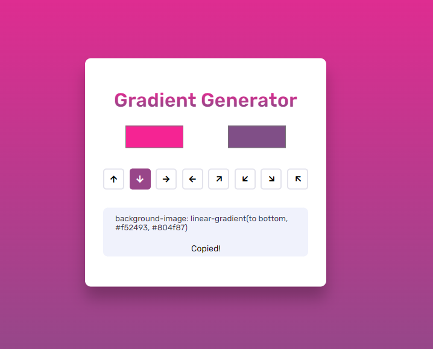

# Gradient Generator 🌈

This is a simple web application that allows you to generate CSS gradient code by selecting colors and direction. You can experiment with different color combinations and gradient directions to find the perfect look for your project.

It is powered by GitHub pages at [https://punit-choudhary.github.io/webcodechest/gradientgenerator/](https://punit-choudhary.github.io/webcodechest/gradientgenerator/) 💜

## Features ✨

- Choose two colors from a color picker
- Select the direction of the gradient from a list of available options
- Copy the generated CSS gradient code to your clipboard with a single click 📋

## Future Enhancements 🚀

- [ ] Option to add more than two colors for gradient
- [ ] Option to generate animated gradient effects
- [ ] Option to generate random gradient effects

## Contributing 🤝

Contributions are welcome! If you have any ideas, suggestions, or improvements, please feel free to open an issue or submit a pull request.

## Screenshot
