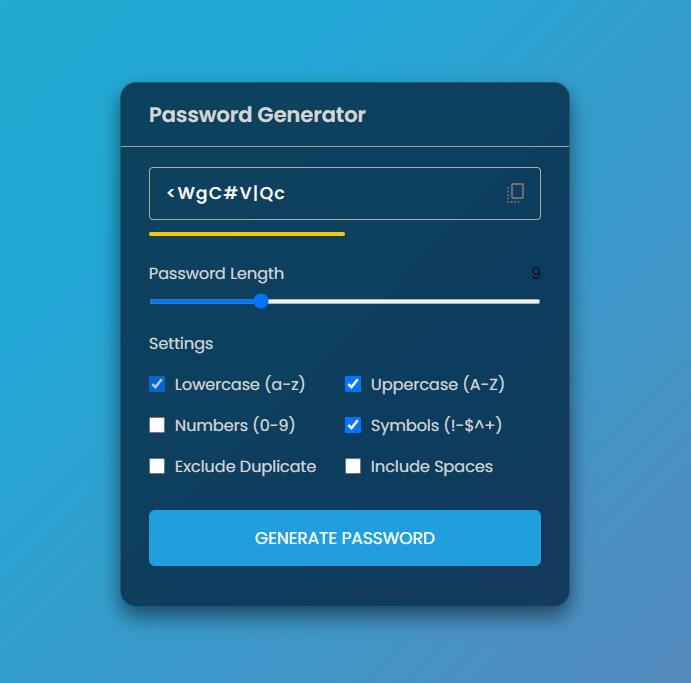

# Passgenerator 🔑

Passgenerator is a simple and straighforward web application that lets you create unique passwords just the way you like them. Whether you need a short or long password, with lowercase letters, uppercase letters, numbers, or symbols - you're in control. Plus, you can choose to avoid repeating characters and even add spaces for extra security. It's easy to customize your passwords to suit your needs.

It is powered by GitHub pages at [https://punit-choudhary.github.io/webcodechest/passgenerator/](https://punit-choudhary.github.io/webcodechest/passgenerator/) 💜

## Features ✨

- Password strength meter.
- Customize password length and character types.
- Option to exclude duplicate characters and include spaces.
- Copy generated passwords with a single click to your clipboard.

## Future Enhancements 🚀

- [ ] Option to generate passphrase-based passwords for enhanced security.

## Contributing 🤝

Contributions are welcome! If you have any ideas, suggestions, or improvements, please feel free to open an issue or submit a pull request.

## Screenshot 🖼️
